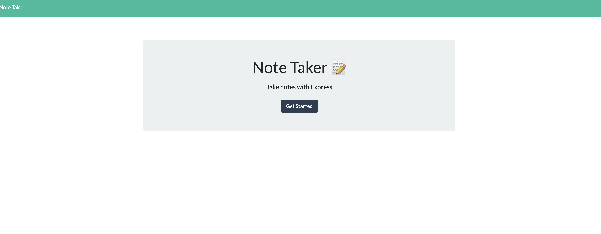

# NOTE TAKER

## Table of Contents

- [Description](#description)
- [Installation](#installation)
- [Usage](#usage)
- [Contributing](#contributing)
- [Tests](#tests)
- [License](#license)
- [Questions](#questions)

## Description

This is a client-side application for a user to input notes for their to-do list, add descriptions and then revisti existing notes and delete them as they are accomplished. The application utilizes an Express.js backend server, flat file database to store the notes and a browser-friendly interface supported by Javascript.

[View the deployed application here.](https://note-taker-sgm.herokuapp.com/)

## Installation

To install source code, clone the github repo locally. To install and use the application, access the link in this readme.

## Usage

The use case for the application is a business owner, or anyone who needs to track their notes or to-dos, can easily keep a record of their notes with a detailed description, and delete them as they need to.

## Contributing

To contribute, clone the github repo and update the code locally, then submit a pull request to have the code merged into the main branch.

## Tests

There are no tests for the application.

## License

    MIT

## Questions

- [GitHub profile](https://github.com/millersg47)
- Contact Me at millersg47@gmail.com with additional questions
